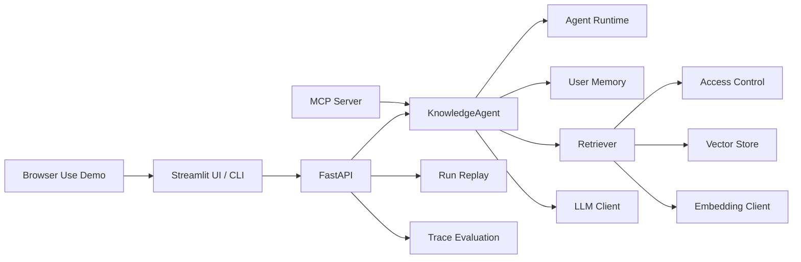

# Enterprise Knowledge Base Agent

面向企业内部知识库场景的 RAG + Agent 应用。项目覆盖文档解析、向量检索、权限过滤、引用溯源、拒答策略、Agent Runtime、Run Replay、Trace Evaluation、MCP tools、LangGraph 工作流 Demo 和 Browser Use 端到端验证。

这个仓库的定位不是“简单问答机器人”，而是一个可本地运行、可测试、可观测、可评估的 AI Agent 工程化样例。

## 一分钟看懂项目

企业内部制度、产品 FAQ、IT 支持和安全合规知识往往分散在不同文档中。直接让大模型回答会带来三个问题：

- 答案是否来自企业知识库无法追溯；
- 知识库里存在管理层/普通员工权限边界；
- 问答失败后难以定位是检索、权限、证据判断还是模型生成出了问题。

本项目围绕这些问题实现了一条完整链路：

```text
文档解析 → Chunk 切分 → Embedding → 向量检索 → 身份权限过滤
→ 证据判断 → LLM 生成/拒答 → Citation 引用 → Runtime 日志 → Trace Evaluation
```

默认配置使用 mock LLM、hash embedding 和本地 JSON vector store，无需 API Key 即可跑通；同时也预留 OpenAI-compatible LLM / Embedding、Chroma、LangGraph、Playwright 等可选接入。

## 核心能力

| 能力 | 说明 |
| --- | --- |
| RAG 问答 | 支持 Markdown/TXT/PDF 文档解析、chunk 切分、向量索引、检索增强生成和引用溯源 |
| 权限治理 | 文档支持 `visibility / allowed_roles / allowed_users`，检索结果进入 LLM 前按 `user_id / roles` 过滤 |
| MCP Tools | 将知识库检索、带引用问答、文档列表封装为 MCP tools，并加入工具级角色权限校验 |
| 长期记忆 | 按用户记录关注产品、主题和最近问题，用于补全模糊指代；事实依据仍只来自知识库引用 |
| Agent Runtime | 每次问答生成 `run_id`，记录步骤状态、耗时、错误、重试和输入输出摘要 |
| Run Replay | 支持按 `run_id` 复盘一次 Agent 执行链路，定位失败步骤和慢步骤 |
| Trace Evaluation | 基于 Runtime 日志统计成功率、重试率、慢步骤、拒答类型和瓶颈步骤 |
| LangGraph Demo | 将记忆召回、检索、证据判断、拒答/生成、记忆更新拆成显式图节点 |
| Browser Use Demo | 使用 Playwright 控制本地 Streamlit 页面完成一次端到端问答并保存截图 |
| 评估闭环 | 维护正例/负例评估集，统计 retrieval recall、citation hit、negative rejection、false refusal、latency，并支持 LLM-as-a-Judge |

## 技术栈

- Backend: Python, FastAPI, Uvicorn
- UI: Streamlit
- RAG: document ingestion, chunking, embedding adapter, vector store adapter, citation, refusal policy
- Agent Infra: MCP stdio server, tool permissions, runtime trace, run replay, trace evaluation
- Workflow: LangGraph optional integration with fallback graph implementation
- Browser automation: Playwright optional demo
- Evaluation: golden QA, negative cases, metric reports, optional LLM judge
- Testing: Pytest

## 架构概览



更详细的设计说明见：

- [docs/architecture.md](docs/architecture.md)
- [docs/final_parameters.md](docs/final_parameters.md)
- [docs/optimization_log.md](docs/optimization_log.md)

## 快速开始

### 1. 安装依赖

```powershell
python -m venv .venv
.\.venv\Scripts\Activate.ps1
pip install -e ".[dev]"
Copy-Item .env.example .env
```

默认 `.env.example` 使用本地 mock 配置，不需要 API Key。

### 2. 构建知识库索引

```powershell
$env:PYTHONPATH="."
$env:VECTOR_STORE="local"
python -m backend.cli index --directory data/sample_docs
```

### 3. 启动后端和前端

后端 API：

```powershell
.\scripts\run_api.ps1
```

前端页面：

```powershell
.\scripts\run_app.ps1
```

访问地址：

- FastAPI Docs: http://127.0.0.1:8000/docs
- Health Check: http://127.0.0.1:8000/health
- Streamlit UI: http://localhost:8501

## 常用演示命令

### 基础问答

```powershell
$env:PYTHONPATH="."
$env:VECTOR_STORE="local"
python -m backend.cli chat "P1 事故需要多久响应？"
```

### 权限过滤

```powershell
$env:PYTHONPATH="."
$env:VECTOR_STORE="local"
$env:LLM_PROVIDER="mock"
$env:EMBEDDING_PROVIDER="hash"
python -m backend.cli index --directory data/sample_docs
python -m backend.cli chat "下一季度招聘预算是否冻结？" --user-id bob --roles employee
python -m backend.cli chat "下一季度招聘预算是否冻结？" --user-id alice --roles manager
```

普通员工会在生成前过滤受限文档并拒答；manager 角色可读取 `restricted` 文档中允许访问的内容。

### 长期记忆

```powershell
$env:PYTHONPATH="."
$env:VECTOR_STORE="local"
$env:LLM_PROVIDER="mock"
$env:EMBEDDING_PROVIDER="hash"
python -m backend.cli chat "Orion 的权限怎么配置？" --user-id alice --roles employee
python -m backend.cli chat "这个平台支持 SSO 吗？" --user-id alice --roles employee
```

第二轮会用用户记忆把“这个平台”补全到 Orion，但答案事实仍必须来自知识库检索片段。

### Run Replay

```powershell
$env:PYTHONPATH="."
python -m backend.cli runs --limit 5
python -m backend.cli run-detail run_xxxxxxxxxxxx
```

### Trace Evaluation

```powershell
$env:PYTHONPATH="."
python -m backend.cli trace-evaluate --limit 50 --slow-run-ms 2000 --slow-step-ms 500
```

### LangGraph 工作流

```powershell
$env:PYTHONPATH="."
python -m backend.cli graph-chat "Orion 支持 SSO 吗？" --user-id alice --roles employee
```

如果安装了 LangGraph：

```powershell
pip install -e ".[langgraph]"
```

系统会使用真实 `StateGraph`；未安装时使用项目内置 fallback graph，保持相同节点和条件分支语义。

### Browser Use Demo

首次运行需要安装可选依赖和 Chromium：

```powershell
.\.venv\Scripts\python.exe -m pip install -e ".[browser]"
.\.venv\Scripts\python.exe -m playwright install chromium
```

一键启动 FastAPI、Streamlit 并运行浏览器演示：

```powershell
.\scripts\run_browser_demo.ps1
```

Demo 会自动打开本地 Streamlit 页面，填写用户身份和问题，提交问答，等待 `Run ID`，提取答案摘要并保存截图。

## 评估结果

当前项目包含 3 组评估集：

- `evals/golden_qa.jsonl`：基础企业知识库问答评估集；
- `evals/real_product_faq_qa.jsonl`：半真实产品 FAQ 评估集；
- `evals/real_product_faq_extended_qa.jsonl`：扩展产品 FAQ，覆盖流程自动化、IT 支持、安全合规、知识治理等场景。

普通评估：

```powershell
$env:PYTHONPATH="."
$env:VECTOR_STORE="local"
python -m backend.cli evaluate --eval-path evals/golden_qa.jsonl
```

LLM Judge 评估：

```powershell
$env:PYTHONPATH="."
$env:VECTOR_STORE="local"
python -m backend.cli evaluate --eval-path evals/real_product_faq_extended_qa.jsonl --top-k 1 --judge
```

近期优化结果：

| 指标 | 优化前 | 优化后 |
| --- | ---: | ---: |
| negative rejection rate | 87.5% | 100% |
| false refusal rate | 0% | 0% |
| avg latency | 1668 ms | 1332 ms |
| LLM judge answer correctness | - | 97.83% |
| LLM judge faithfulness | - | 100% |
| LLM judge citation support | - | 100% |

说明：LLM Judge 默认关闭，适合离线评估，不建议放入实时问答链路。

## API

| Method | Path | 功能 |
| --- | --- | --- |
| GET | `/health` | 查看运行配置和健康状态 |
| POST | `/documents/upload` | 上传 `.md`、`.txt`、`.pdf` 文档 |
| GET | `/documents` | 查看文档目录和索引状态 |
| DELETE | `/documents/{filename}` | 删除原始文档并同步清理索引 |
| POST | `/index/build` | 构建或重建索引 |
| POST | `/chat` | 执行 RAG + Agent 问答 |
| GET | `/runs` | 查看最近 Agent Runtime 运行摘要 |
| GET | `/runs/{run_id}` | 查询单次运行的完整执行时间线 |
| POST | `/eval/run` | 运行 QA 评估集 |
| POST | `/eval/traces` | 分析 Runtime 日志并输出 Trace Evaluation |
| GET | `/logs/chat` | 查看最近问答日志 |

## 项目结构

```text
backend/
  main.py                 FastAPI API
  cli.py                  CLI entrypoint
  mcp_server.py           MCP stdio server
  graphs/                 LangGraph / fallback graph workflow
  services/
    ingestion.py          文档解析和 chunk 切分
    embeddings.py         Embedding 适配层
    vector_store.py       Chroma / Local JSON 向量库
    retriever.py          检索、query rewrite、rerank
    llm.py                LLM 适配层
    agent.py              轻量 Agent 编排
    access_control.py     文档级权限过滤
    tool_permissions.py   工具级权限治理
    runtime.py            Agent Runtime
    runtime_logs.py       Run Replay
    trace_evaluation.py   Trace Evaluation
    evaluation.py         QA 评估
app/
  streamlit_app.py        Web demo UI
data/
  sample_docs/            示例企业文档
  real_product_faq/       半真实产品 FAQ 文档
evals/                    QA 评估集
docs/                     架构和优化文档
scripts/                  本地启动和演示脚本
tests/                    Pytest tests
```

## 测试

```powershell
.\.venv\Scripts\python.exe -m pytest
```

当前测试覆盖 ingestion、retriever、agent、evaluation、document governance、observability、runtime、run replay、MCP、工具权限、LangGraph、Browser Use 和 rerank。

## 真实模型接入

默认配置用于本地稳定演示。接入真实模型只需要修改 `.env`。

DeepSeek OpenAI-compatible 示例：

```env
LLM_PROVIDER=openai
LLM_API_KEY=your_deepseek_api_key
LLM_BASE_URL=https://api.deepseek.com
LLM_MODEL=deepseek-v4-flash
EMBEDDING_PROVIDER=hash
VECTOR_STORE=local
```

OpenAI-compatible Embedding 示例：

```env
EMBEDDING_PROVIDER=openai
EMBEDDING_API_KEY=your_embedding_api_key
EMBEDDING_BASE_URL=https://api.openai.com/v1
EMBEDDING_MODEL=text-embedding-3-small
```

切换 embedding 后必须重新构建索引，因为不同 embedding 模型的向量空间不兼容。

## 当前边界

这是一个单机轻量版企业知识库 Agent 项目，重点展示 AI 应用开发、Agent Infra、权限治理、可观测性和评估优化能力。生产化方向包括：

- 接入真实 SSO/OAuth、组织架构和租户体系；
- 使用真实 embedding / reranker / 向量数据库；
- 接入 OpenTelemetry、集中日志、监控告警和审计系统；
- 增加异步任务队列、并发控制、容器化部署和灰度发布；
- 对 Browser Use 加入操作审计、敏感动作确认和截图脱敏。
