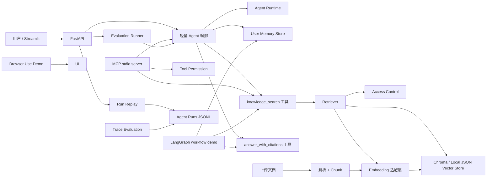
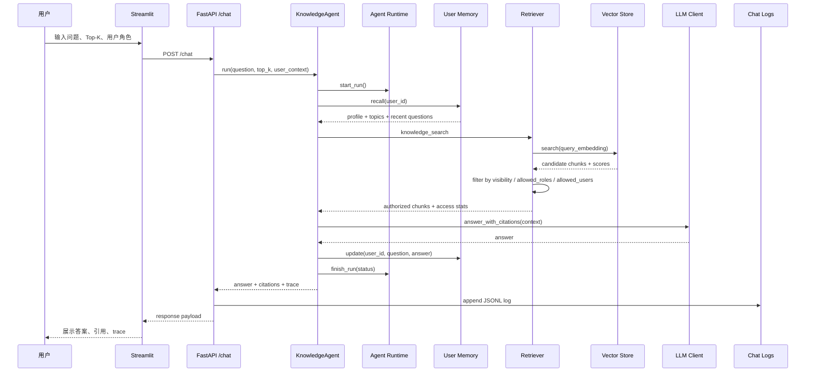
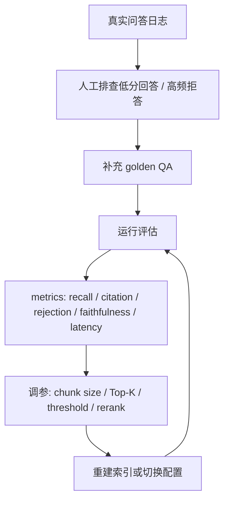

# 架构说明

## Chat 请求链路

## 优化闭环

## 核心链路

1. 用户上传 Markdown、TXT 或 PDF。
2. ingestion 服务解析文本并按 `CHUNK_SIZE`、`CHUNK_OVERLAP` 切分。
3. embedding 适配层生成向量，默认使用 deterministic hashing embedding，生产可切 OpenAI-compatible embedding。
4. vector store 默认尝试 Chroma，缺依赖时回退到本地 JSON 向量库。
5. 用户请求携带 `user_id` 和 `roles`，检索结果先经过权限过滤，无权 chunk 不进入 LLM 上下文。
6. Agent 按 `user_id` 召回长期记忆，用于补全模糊指代和用户偏好，但不把记忆当作事实依据。
7. Agent 调用 `knowledge_search` 检索，再调用 `answer_with_citations` 基于上下文生成答案。
8. Runtime 为每个步骤记录状态、耗时、错误和重试信息，并落盘运行日志。
9. API 返回答案、引用、检索片段、工具调用轨迹、runtime steps 和延迟。

## 身份权限链路

- 文档可在 front matter 中声明 `visibility`、`allowed_roles`、`allowed_users`。
- 默认文档为 `internal`，普通员工可访问；`restricted` 文档需要命中指定角色或用户；`admin` 角色具备全量读取权限。
- `/chat` 请求支持 `user_id` 和 `roles`，CLI 与 Streamlit 也支持传入相同身份信息。
- `access_control` trace 会记录候选 chunk、可见 chunk、被过滤 chunk 数，不暴露无权文档内容。
- 当前实现是面试项目中的轻量 RBAC/ABAC 演示，生产环境应继续对接 SSO/OAuth、组织架构、审计日志和向量库原生 metadata filter。

## 长期记忆链路

- 记忆按 `user_id` 存储在 `MEMORY_PATH`，默认路径为 `storage/user_memory.json`。
- 当前存储内容包括用户常关注产品、历史关注主题和最近问题窗口，不存储受限答案正文。
- `memory_recall` 在检索前执行，可将“这个平台”“上次那个产品”等模糊指代补全为用户长期关注产品。
- `memory_update` 在回答后执行，基于问题抽取产品偏好和主题计数，便于后续个性化查询理解。
- Prompt 明确约束：长期记忆只能用于理解用户偏好或补全指代，不能作为事实依据；事实、数字、流程仍必须来自知识库上下文和 citation。

## MCP 工具链路

- `python -m backend.cli mcp` 会启动轻量 MCP stdio server。
- `tools/list` 暴露 `search_knowledge_base`、`ask_knowledge_base`、`list_documents` 三个工具。
- `tools/call` 调用工具时会传入 `user_id`、`roles`、`query/question`、`top_k` 等参数。
- MCP 工具不绕过业务逻辑：检索、权限过滤、长期记忆、引用和 trace 都复用现有 Agent/Retriever 实现。
- 当前实现不依赖 MCP SDK，按 JSON-RPC stdio 方式实现核心协议，适合面试项目演示；生产环境可替换为官方 SDK 并接入鉴权、调用审计和工具注册中心。

## 工具级权限治理

- 文档权限控制“用户能读哪些 chunk”，工具权限控制“用户能调用哪些工具”。
- `search_knowledge_base` 和 `ask_knowledge_base` 默认允许 `employee / manager / admin` 调用。
- `list_documents` 默认只允许 `admin` 调用，避免普通员工通过 MCP 执行文档治理类能力。
- MCP `tools/call` 在执行工具前先调用 tool permission check，拒绝时返回 `isError=true` 与结构化 `tool_permission` 决策。
- 当前策略是静态角色表，生产环境可扩展为租户级策略、工具注册中心、审计日志和动态授权。

## 轻量 Runtime 链路

- 每次 Agent 执行生成 `run_id`，状态从 `running` 变为 `succeeded` 或 `failed`。
- Runtime step 统一记录 `name`、`status`、`started_at`、`latency_ms`、`input`、`output`、`error` 和 `attempt`。
- `answer_generation` 支持失败重试，默认重试次数由 `RUNTIME_LLM_MAX_RETRIES` 控制。
- 运行记录追加到 `RUNTIME_LOG_PATH`，默认 `storage/agent_runs.jsonl`。
- `GET /runs` 读取最近运行摘要，`GET /runs/{run_id}` 按 run_id 返回 timeline、steps 和原始运行记录，CLI 对应 `runs` 和 `run-detail`。
- 当前是单机轻量 Runtime，用于展示任务执行、观测和复盘能力；生产级还需要分布式队列、并发控制、租户隔离、可视化运维和集中审计。

## Run Replay 运行记录查询

- Run Replay 读取 Runtime 写入的 JSONL 运行日志，不重新执行 Agent，因此适合排查线上或演示过程中的历史问题。
- 列表视图返回 `run_id`、问题、用户身份、状态、总耗时、步骤数、失败步骤数和步骤名称，用于快速定位异常运行。
- 详情视图按步骤展示 timeline，包括每个 step 的输入摘要、输出摘要、耗时、错误和 attempt，能定位问题发生在记忆召回、权限过滤、检索、证据检查、生成还是记忆更新。
- 当前实现是单机文件日志查询，定位为面试项目中的轻量可观测能力；生产环境可进一步接入 OpenTelemetry、集中日志、Trace UI、租户隔离和审计检索。

## Agent Trace Evaluation 链路评估

- Trace Evaluation 读取 Runtime JSONL 日志，不重新执行 Agent，也不调用 LLM，用低成本方式评估执行链路质量。
- `POST /eval/traces` 和 CLI `trace-evaluate` 会输出 `metrics`、`step_stats`、`bottleneck_steps`、`problem_runs` 和 `recommendations`。
- 指标覆盖 run 成功率、失败步骤率、重试率、慢 run/step、权限拒答率、知识拒答率、检索阈值过滤为空比例、证据检查过滤为空比例和 step 级 p95 latency。
- `problem_runs` 保留 `run_id`，可以继续通过 Run Replay 查看完整执行时间线，形成“先用指标发现问题，再按 run_id 复盘细节”的排查流程。
- 当前是轻量离线评估，生产环境可扩展为定时任务、告警规则、OpenTelemetry trace、集中日志查询和长期趋势看板。

## 轻量 Browser Use / Computer Use Demo

- CLI `browser-demo` 基于 Playwright 控制 Chromium 访问本地 Streamlit 页面。
- 自动执行打开页面、填写用户 ID、填写角色、填写问题、点击“提问”、等待 `Run ID`、提取答案摘要和保存截图。
- 这个 Demo 从用户视角验证 UI、API、RAG、权限、Runtime 和日志链路是否端到端可用。
- 当前是脚本化浏览器工具演示，不是通用自主 Computer Use Agent；生产环境可继续扩展页面识别、操作审计、敏感动作二次确认、超时重试和截图脱敏。

## LangGraph 工作流 Demo

- `python -m backend.cli graph-chat "问题"` 会运行图编排版知识库问答流程。
- 图节点包括 `normalize_user`、`memory_recall`、`retrieve`、`evidence_check`、`answer/refusal`、`memory_update`。
- `evidence_check` 后通过条件边分流：有可用证据进入 `answer`，没有可用证据进入 `refusal`。
- 如果安装了 `langgraph` 可选依赖，系统使用真实 `StateGraph`；否则使用内置 `fallback_state_graph` 保持相同节点和条件分支语义。
- 这个 demo 的目标是展示复杂 Agent 流程如何从单个 `run()` 函数拆成显式节点，便于后续扩展人工确认、工具 fallback、循环规划或更复杂工作流。

## 检索和 Rerank

默认检索链路是向量分数与关键词分数融合排序。开启 `RERANK_ENABLED=true` 后，系统会进入两阶段检索：

1. 先从向量库召回更多候选 chunk，数量由 `RERANK_CANDIDATE_MULTIPLIER` 控制。
2. 再用轻量 rerank 计算融合分数：原检索分数、query 与 chunk 的关键词重合度、query 与 source/title 的 metadata 匹配。
3. 最后保留 `RERANK_KEEP_K` 个 chunk 进入生成阶段。

当前 rerank 是本地轻量实现，目的是演示工程结构和评估方法。生产可替换成专门 rerank 模型。

## 文档治理链路

- `GET /documents` 从原始文档目录和向量库 metadata 合并出文档清单。
- 每个文档展示磁盘文件是否存在、是否已索引、indexed chunk 数、文件大小和修改时间。
- `DELETE /documents/{filename}` 会先删除原始文件，再调用 vector store 的 `delete_source` 删除该文档对应的 chunk。
- 这个设计保证“用户看到的知识库文档”和“检索实际使用的索引”可以对齐，避免删除文件后旧知识仍被检索到。

## 可观测性链路

- `/chat` 返回答案后会追加一条 JSONL 日志到 `storage/chat_logs.jsonl`。
- 日志记录 question、answer、引用来源、检索来源、score、latency、是否拒答和 Agent trace。
- `GET /logs/chat` 读取最近日志，Streamlit 的“历史”页用于人工排查和演示。
- `GET /runs` 与 `GET /runs/{run_id}` 读取 Agent Runtime 日志，Streamlit 的“运行记录”页用于按 run_id 复盘完整执行链路。
- `POST /eval/traces` 聚合 Runtime 日志，Streamlit 的“评估”页用于查看链路质量指标、瓶颈步骤和疑似问题 run。
- 这些日志可以反向沉淀为新的 golden QA，尤其适合发现高频拒答问题和低分检索问题。

## 模型和存储适配

系统把模型供应商和业务逻辑解耦：

- `MockLLMClient` 用于离线演示、测试和 CI，输出稳定但不代表真实大模型能力。
- `OpenAIChatClient` 通过 OpenAI-compatible `/chat/completions` 接口接入真实 LLM。
- `HashingEmbeddingClient` 用于本地 deterministic embedding，便于无网络环境复现。
- `OpenAIEmbeddingClient` 通过 OpenAI-compatible `/embeddings` 接口接入真实 embedding。
- `LocalJsonVectorStore` 用于轻量本地演示，`ChromaVectorStore` 用于更接近生产的持久化向量库。

切换真实模型时主要修改 `.env`，RAG、Agent、评估和 UI 代码不需要改。

## 面试讲解重点

- RAG 不是只“把文档塞给模型”，而是有解析、切分、索引、检索、生成、引用和评估的完整链路。
- Agent 层没有重度绑定 LangChain，工具调用轨迹清楚，便于解释“什么时候检索、什么时候拒答、怎么溯源”。
- 评估不是主观看答案，而是用 golden QA 统计 retrieval recall、citation hit、answer relevance、faithfulness 和 latency。
- 通过适配层隔离 LLM、embedding 和 vector store，避免业务代码绑定某个模型供应商。
- 检索优化采用两阶段结构，先召回再 rerank，便于替换更强的 reranker。
